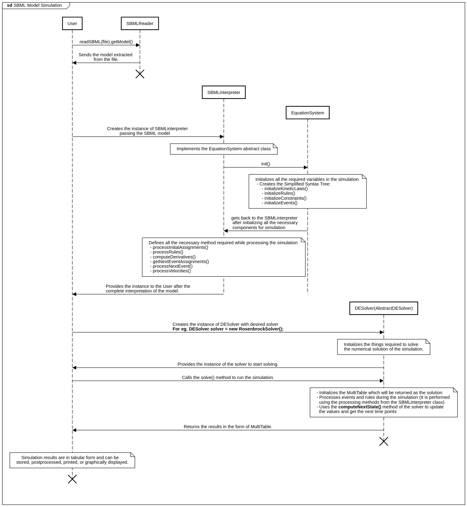
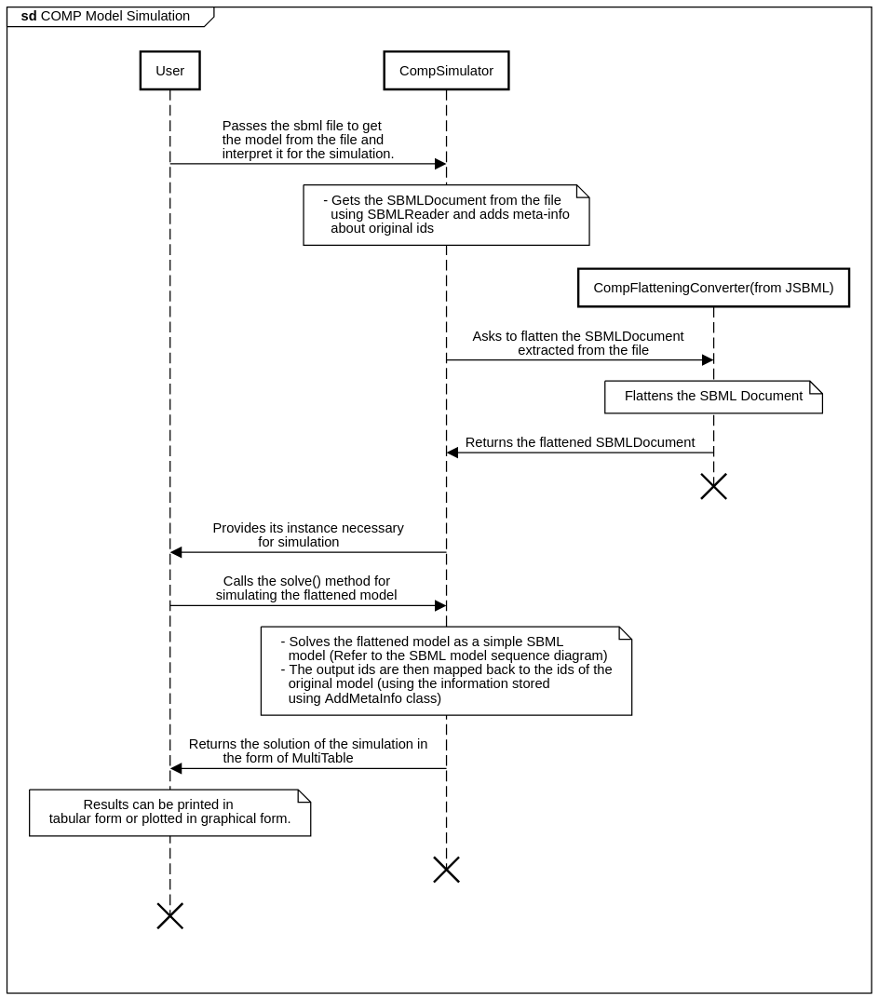
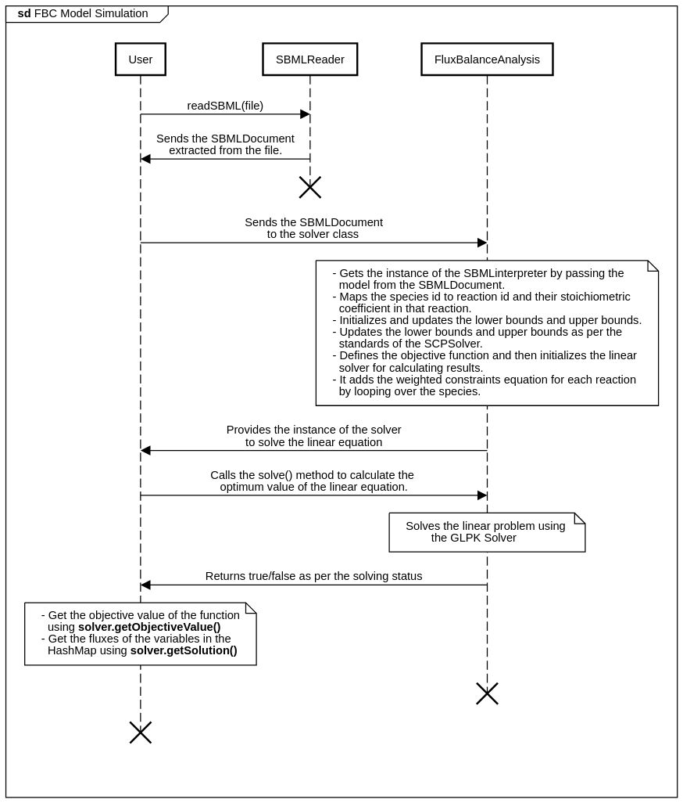
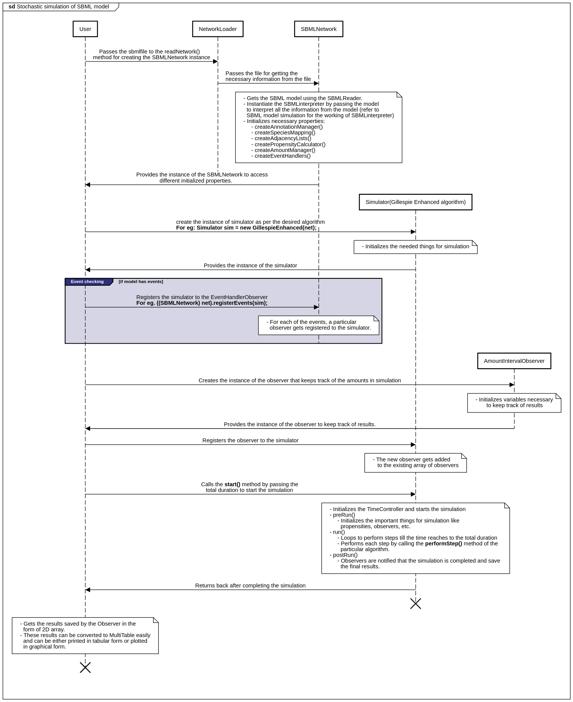

# Guidelines to use SBSCL for simulating the models

# Index  
* [SBML model simulation](#simulating-the-sbml-models)
* [COMP model simulation](#simulating-the-sbml-models-with-comp-extension)  
* [FBC model simulation](#simulating-the-sbml-models-with-fbc-extension)
* [Stochastic simulation of SBML models](#stochastic-simulation-of-the-sbml-models)

## Simulating the SBML models

- First, a model has to be read from the file using the [SBMLReader](https://github.com/sbmlteam/jsbml/blob/master/core/src/org/sbml/jsbml/SBMLReader.java) by [JSBML](https://github.com/sbmlteam/jsbml). With this model as a parameter, the [SBMLinterpreter](https://github.com/draeger-lab/SBSCL/blob/master/src/main/java/org/simulator/sbml/SBMLinterpreter.java) instance is created which provides the basis of the simulation initializing all the properties of the model (using the [EquationSystem](https://github.com/draeger-lab/SBSCL/blob/master/src/main/java/org/simulator/sbml/EquationSystem.java) class), and contains the methods required for processing various functionalities like rules, events, etc.

 ```java
Model model = (new SBMLReader()).readSBML(fileName).getModel();
EquationSystem interpreter = new SBMLinterpreter(model);
```

- Once the interpreter has been created, one can simulate the model with an available solver (preferably [Rosenbrocksolver](https://github.com/draeger-lab/SBSCL/blob/master/src/main/java/org/simulator/math/odes/RosenbrockSolver.java)) providing time points (instead of time points the initial time, end time, and the step size can be provided). The simulation results are stored in a MultiTable.

```java
// An example of solving with Rosenbrock solver
DESSolver solver = new RosenbrockSolver();
solver.setStepSize(stepSize); // Setting the step size for the model
MultiTable solution = solver.solve(interpreter, 
              interpreter.getInitialValues(), 0d, timeEnd, simulatorExample);
```

- One can now print the [MultiTable](https://github.com/draeger-lab/SBSCL/blob/master/src/main/java/org/simulator/math/odes/MultiTable.java) or can plot it using the [PlotMultiTable](https://github.com/draeger-lab/SBSCL/blob/master/src/main/java/org/simulator/plot/PlotMultiTable.java) where you can see the changing values in a graphical form. Also, you can view it in a tabular form using the JTable class.

**Note:** To set the absolute and relative tolerances for the specific simulation, you can use the method provided by the [DESolver](https://github.com/draeger-lab/SBSCL/blob/master/src/main/java/org/simulator/math/odes/DESSolver.java) using the below code snippets:
```java
((AdaptiveStepsizeIntegrator) solver).setAbsTol(absTol);
((AdaptiveStepsizeIntegrator) solver).setRelTol(relTol);
```

For the complete code on how to simulate an SBML model, please refer to the [SimulatorExample](https://github.com/draeger-lab/SBSCL/blob/master/src/main/java/org/simulator/examples/SimulatorExample.java) in the repository.

Workflow of SBML model simulation using a sequence diagram:


## Simulating the SBML models with comp extension
- Simulating the comp models is quite easy as you just need to provide a file to the [CompSimulator](https://github.com/draeger-lab/SBSCL/blob/master/src/main/java/org/simulator/comp/CompSimulator.java), and it performs all the tasks including the initializations and processings.

```java
CompSimulator compSimulator = new CompSimulator(sbmlfile);
```

- After creating the instance of the simulator, you have to call the `solve()` method of the CompSimulator class with duration and step size to get the results in the form of MultiTable.

```java
// Here, 10.0 refers to the total duration
//       0.1 refers to the step size 
MultiTable solution = compSimulator.solve(10.0, 0.1);
```

- After this, you can view the results either by printing or by [PlotMultiTable](https://github.com/draeger-lab/SBSCL/blob/master/src/main/java/org/simulator/plot/PlotMultiTable.java) (in graphical form) or by JTable (in tabular form).

For the complete code on how to simulate the comp model, please refer to the [CompExample](https://github.com/draeger-lab/SBSCL/blob/master/src/main/java/org/simulator/examples/CompExample.java) in the repository.

Workflow of COMP model simulation using a sequence diagram:


## Simulating the SBML models with fbc extension

- Similar to the CompSimulator, here we have to provide the [SBMLDocument](https://github.com/sbmlteam/jsbml/blob/master/core/src/org/sbml/jsbml/SBMLDocument.java) by reading from the file to the [FluxBalanceAnalysis](https://github.com/draeger-lab/SBSCL/blob/master/src/main/java/org/simulator/fba/FluxBalanceAnalysis.java) class which implements all the flux balance analysis functionality.

```java
SBMLDocument document = new SBMLReader().read(sbmlfile);
FluxBalanceAnalysis solver = new FluxBalanceAnalysis(document);
```

- After this, you just need to call `solve()` method of FluxBalanceAnalysis that returns a boolean indicating of the simulation was successful.

```java
boolean solvedStatus = solver.solve();
```

- After solving the FBA problem the simulation results can be accessed via.  
```java
if(solvedStatus == true) {
  solver.getObjectiveValue()  // provides the objective value of the active objective function
  solver.getSolution()        // provides the results in the form of HashMap with keys as the ids and values as their corresponding fluxes
}
```

For complete code on how to simulate the fbc model, please refer to the [FBAExample](https://github.com/draeger-lab/SBSCL/blob/master/src/main/java/org/simulator/examples/FBAExample.java) in the repository.

Workflow of FBC model simulation using a sequence diagram:


## Stochastic simulation of the SBML models

- For performing the stochastic simulation, you will have to first provide the basic properties like filePath, duration, interval (step size), etc in the form of a HashMap (as remains quite handy to initialize everything at one place, and just give the key and get value).

```java
Map<String, Object> orderedArgs = new HashMap<String, Object>();
orderedArgs.put("file", path_of_the_file);
orderedArgs.put("time", Double.parseDouble("50.0")); // duration of the simulation
orderedArgs.put("interval", Double.parseDouble("1.0")); // interval between two time points
```

- Once you create the basic HashMap with the arguments shown above, you need to create a [SBMLNetwork](https://github.com/draeger-lab/SBSCL/blob/master/src/main/java/fern/network/sbml/SBMLNetwork.java) (implemented from [Network](https://github.com/draeger-lab/SBSCL/blob/master/src/main/java/fern/network/Network.java) interface) instance, using the `loadNetwork()` method from [NetworkTools](https://github.com/draeger-lab/SBSCL/blob/master/src/main/java/fern/tools/NetworkTools.java) class, which derives all the needed information from the model.

```java
Network net = NetworkTools.loadNetwork(new File((String) orderedArgs.get("file")));
``` 

- After creating the network, you need to initialize the [Simulator](https://github.com/draeger-lab/SBSCL/blob/master/src/main/java/fern/simulation/Simulator.java) with the algorithm you wish to simulate by passing the SBMLNetwork instance.

```java
// Initializes simulator with the GillespieEnhanced Algorithm
Simulator sim = new GillespieEnhanced(net);
```

All supported algorithms for stochastic simulation are available in the [/java/fern/simulation/algorithm](https://github.com/draeger-lab/SBSCL/tree/master/src/main/java/fern/simulation/algorithm) directory.

**Note:** If your SBML model contains any events, then the network has to call `registerEvents()` passing the simulator as to keep track of event properties like trigger, delays, and others by the [SBMLEventHandlerObserver](https://github.com/draeger-lab/SBSCL/blob/master/src/main/java/fern/network/sbml/SBMLEventHandlerObserver.java).
```java
((SBMLNetwork) net).registerEvents(sim);
```  

- After initializing the simulator, we need to initialize an observer (instance of [AmountIntervalObserver](https://github.com/draeger-lab/SBSCL/blob/master/src/main/java/fern/simulation/observer/AmountIntervalObserver.java) class) which will keep track of the amounts of species throughout the simulation process. For this, we first need to get all the identifiers (species ids) using the [NetworkTools](https://github.com/draeger-lab/SBSCL/blob/master/src/main/java/fern/tools/NetworkTools.java) class.

```java
String[] species = NetworkTools.getSpeciesNames(sim.getNet(),
                    NumberTools.getNumbersTo(sim.getNet().getNumSpecies() - 1)); // gets the ids of the species

// Initializes the observer and also registers it to the simulator using addObserver() method
AmountIntervalObserver obs = (AmountIntervalObserver) sim.addObserver(
        new AmountIntervalObserver(sim, (Double) orderedArgs.get("interval"),
            ((Double) orderedArgs.get("time")).intValue(), species));
```

- Above steps completes all the initialization part and now to simulate, you just need to call the `start()` method of Simulator passing the total duration of the simulation.

```java
sim.start((Double) orderedArgs.get("time")); // runs the stochastic simulation for the defined duration
```

- On completing the simulation, all the results are stored with the observer from which you can access it in the form of 2-D array which can also be converted to [MultiTable](https://github.com/draeger-lab/SBSCL/blob/master/src/main/java/org/simulator/math/odes/MultiTable.java) (refer the [Start.java](https://github.com/draeger-lab/SBSCL/blob/master/src/main/java/fern/Start.java) file).
```java
obs.getAvgLog() // provides the results in 2-D array form
```

The complete code of stochastic simulation of the SBML models can be found at the [Start.java](https://github.com/draeger-lab/SBSCL/blob/master/src/main/java/fern/Start.java) file (with proper commenting) and separated under different methods defining particular use cases.

Workflow of stochastic simulation by sequence diagram:

